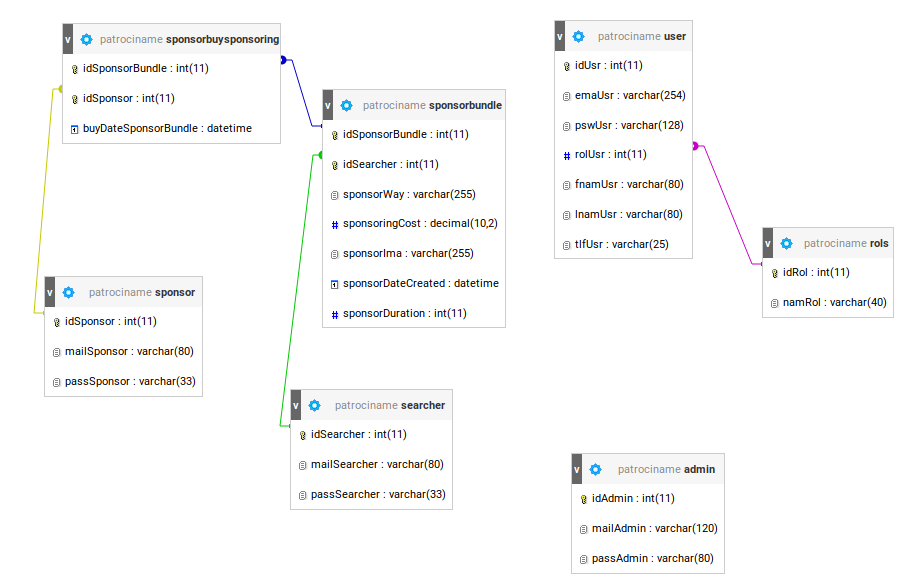

## Documentación
## Base de Datos

##### @author Alejandro Ruiz
##### @ Proyecto Fin de Grado de DAW 2018/2019

# Sentencias usadas MySQL

### Común a todas las bases de datos:
* Selecciona el mínimo ID disponible en una base de datos cuando el mínimo es mayor que 1, si no pone el 1.

#### Esquema



```mysql
SELECT
  CASE ( SELECT MIN($id) FROM $this->table )
    WHEN 1 THEN
      ( SELECT MIN(t1.$id) + 1
        FROM $this->table t1
        LEFT JOIN $this->table t2
        ON t1.$id + 1 = t2.$id
        WHERE t2.$id IS NULL )
      ELSE ( SELECT 1 )
  END AS minId;
;
```

### Administrador:
* Selecciona por cada día cuantos pauqetes de publicidad fueron creados en total por los usuarios.

```mysql
SELECT
  DATE_FORMAT(t1.sponsorDateCreated, '%Y-%m-%d') AS `sponsorDateCreated`,
  COUNT(t1.sponsorDateCreated) AS 'numTotalSponsorCreated'
  FROM sponsorbundle t1
  GROUP BY DATE_FORMAT(t1.sponsorDateCreated, '%Y-%m-%d')
;
```

### Paquetes de Publicidad:
* Selecciona todos los paquetes de publicidad que ha creado un buscador de publicidad tanto si se han comprado como si no.

```mysql
SELECT
  t1.idSponsorBundle, t1.idSearcher, t1.sponsorWay, t1.sponsoringCost,
  t1.sponsorIma, t1.sponsorDateCreated, t1.sponsorDuration,
  t2.buyDateSponsorBundle,
  t3.mailSponsor
  FROM sponsorbundle t1
  LEFT JOIN sponsorbuysponsoring t2
    ON t1.idSponsorBundle = t2.idSponsorBundle
  LEFT JOIN sponsor t3
    ON t2.idSponsor = t3.idSponsor
   WHERE t1.idSearcher = :id
;
```

* Selecciona para un sponsor todos los paquetes de publicidad disponibles creados por los buscadores, menos los que ya ha comprado (que ya no están disponibles).

```mysql
SELECT * FROM $this->table
WHERE idSponsorBundle !=
ALL(SELECT idSponsorBundle
  FROM sponsorbuysponsoring
  WHERE idSponsor = :idSponsor)
;
```

* Selecciona para un sponsor todos los paquetes de publicidad disponibles creados por los buscadores, menos los que ya ha comprado (que ya no están disponibles). Dependiendo de la pagina en que se encuentre limtes: $beginSearch y $stopSearch.

```mysql
SELECT * FROM $this->table
WHERE idSponsorBundle !=
ALL(SELECT idSponsorBundle
  FROM sponsorbuysponsoring
  WHERE idSponsor = :idSponsor)
ORDER BY sponsorDateCreated DESC
LIMIT $beginSearch, $stopSearch
;
```

