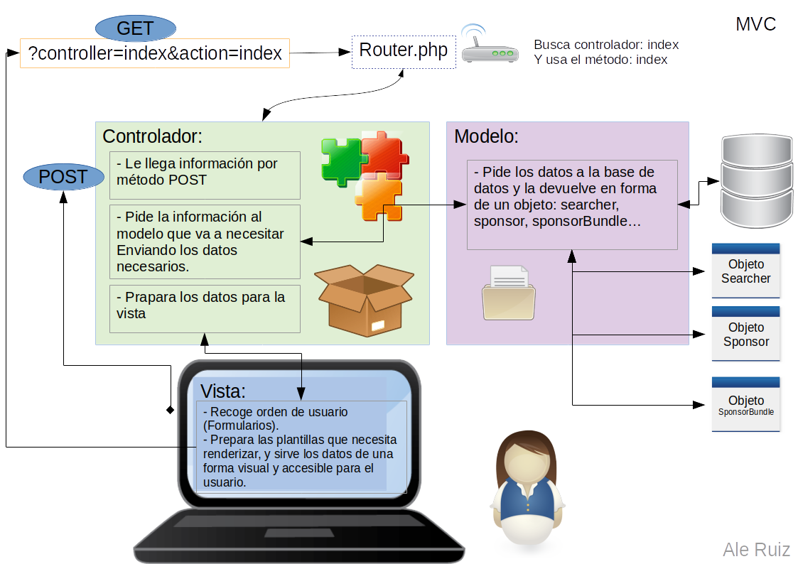

## Documentación
## Base de Datos

##### @author Alejandro Ruiz
##### @ Proyecto Fin de Grado de DAW 2018/2019

### Desarrollo Web en Entorno Programación

# Esquema Model Vista Contralador

---

Patrones usados:

- Patrón Modelo Vista Controlador para la administración y manejo de la información.