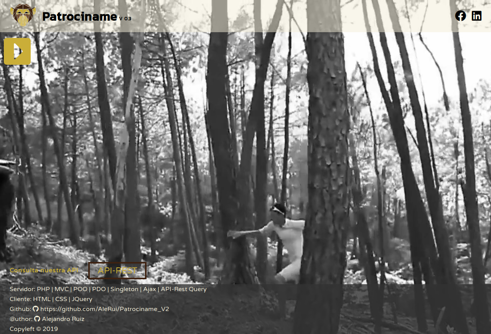

App para la asignatura DWES de 2ºDAW

Tecnologías de Servidor usadas: PHP | MVC | POO | PDO | Singleton | Ajax | API-Rest Query

Tecnologías de Cliente usadas: Semantic | JQuery

# Patrociname

Patrociname es una aplicación para que, por un lado _"buscadores"_: personas, clubes, organizaciones... busquen patrocinadores, pudiendo definir que manera y precio tienen para anunciarse. Por otro lado _"Sponsors"_: entidades, empresas... que quieran patrocinarse, busquen con quien o donde hacerlo.

## Index
En la zona de index podras registrarte como buscador o sponsor, o hacer "login" como usuario o sponsor. Cuando te registra te envía a la zona de buscador o sponsor y se inicia una sesión para buscardor o sponsor.

Para registrarte hay creado los usuarios:
* buscador: prueba@prueba.com | Pass: 123
* Sponsor: sposnor1@sponsor.com | Pass: 123

Por otro lado podrá usarse públicamente para ver buscadores de patrocinio y sus condiciones.

## Zona de Buscador
Se indicarán los datos de buscador.
Y un boton de "Logout" para salir de la zona de buscador y acabar la sesión.

Tenemos un formulario para añadir un anuncio de como queremos que se publiciten con el buscador de patrocinio y el coste de esta publicidad.

Más abajo nos encontramos una zona con todos nuestro anuncios de patrocinio creados.

## Zona de Sponsor
En la zona de Sponsor podemo comprobar un CIF de Empresa en la API de einforma: https://www.einforma.com/marketing/api-empresas
Si el CIF esta en su base de datos te atrerá información de la empresa.
Puedes probar con el CIF: B93516763

A continuación hay un boton que te carga todos los anuncios de buscadores que están buscando sponsor, y puedes comprar el tipo de sponsorización

En la zona inferior podrás ver todos los anuncios cde buscadores comprados.

