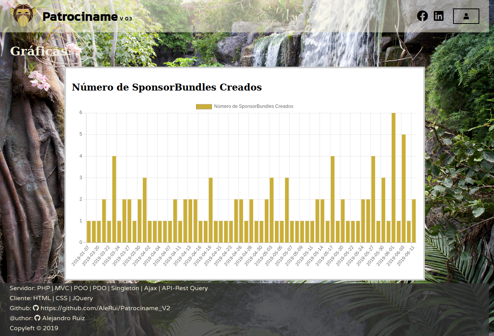

# Proyecto Fin de Grado para el Ciclo de Grado formativo Superior de Desarrollo de Aplicaciones Web

##### @author: Alejandro Ruiz López
##### @Curso: 2º DAW 2018/2019

# Patrociname

---

## www.patrociname.alerui.com

---

Patrociname es una aplicación web "responsiva" que pone en contacto a  _**"Buscadores"**_ ('Searchers'): personas, clubes, organizaciones... busquen patrocinadores, pudiendo definir la manera, precio, duración... en la que pueden gestionar una publicidad, con  _**"Sponsors"**_: entidades, empresas... que quieran patrocinarse y busquen con quien o donde hacerlo.
<br><br>
   
## Zonas de la Aplicación

### Index

<table>
	<tr>
		<td style="width: 48%;">
			<ul>En la zona de index podras:
				<li>Registrarse como buscador. Al poner un email que ya existe lo indica.</li>
				<li>Registrarse como sponsor. Al poner un email que ya existe lo indeica.</li>
				<li>Entrar mediante "login" a la zona de usuario usuario. </li>
				<li>Entrar mediante "login" a la zona de sponsor.</li>
				<li>Todos los formularios tienen validaciones en cliente.</li>
				<li>Consultar mediante un Api los paquetes de patrocinio disponibles.</li>
				<li>Entrar a una zona de administrador para ver estadíticas.</li>
			</ul>
			<ul>Para usar la aplicación sin registrarse hay creado los usuarios: 
				 <li>Buscador: prueba@prueba.com | Pass: 123</li>
				 <li>Sponsor: prueba@prueba.com | Pass: 123</li>
		</td>
		<td style="width: 48%;">
			
		</td>
	</tr>
	<tr>
		<td colspan="2">
			
		</td>
	</tr>
</table>

---

### Zona de Buscador / Searcher

<table>
	<tr>
		<td style="width: 48%;">
			<p>En esta zona el buscador podrá crear sus paquetes de patrocinio ("SposnsorBundles"). Para ello usará el formulario superior para crear el paquete. Y en la zona de abajo podrár ver los paquetes creados, editarlos o borrarlos.</p>
			<ul>Cada paquete consta de:
			<li>Texto sobre como va a ser la manera de publicitar.</li>
			<li>Coste de la publicidad.</li>
			<li>Periodo de tiempo por el que se genera la publicidad.</li>
			<li>La fecha en la que se creó.</li>
			<p>Además arriba a la izquierda de la barra de header se habilitar un boton de "Logout" para salir de la zona de buscador y acabar la sesión.</p>
		</td>
		<td style="width: 48%;">
			
		</td>
	</tr>
</table>

---

### Zona de Sponsor

<table>
	<tr>
		<td style="width: 48%;">
			<ul>En la zona de Sponsor podemos realizar las siguientes acciones:
			<li>Comprobar mediante una Api externa un CIF de Empresa. La API es la de einforma: https://www.einforma.com/marketing/api-empresas. Si el CIF esta en su base de datos trerá la información de la empresa.</li>
			<li>A continuación se mostraran los paquetes de patrocinio comprados. Que incluyen la fecha de cuando fueron comprados.</li>
			<li>En la zona inferior podrá usar un boton para buscar más paquetes. Estos se mostrarán paginados con fecha de más reciente hasta el ultimo.</li>
		</td>
		<td style="width: 48%;">
			
		</td>
	</tr>
</table>

---

### Zona de Administrador

Para entrar a esta zona habra que introducir:
```html
https://patrociname.alerui.com/admin.php
```

<table>
	<tr>
		<td style="width: 48%;">
			<p>En esta zona el administrador podrá comprobrar estádísticas de el número de paquetes creados por día.</p>
		<td style="width: 48%;">
			
		</td>
	</tr>
</table>

---

### Algunas consideraciones más a tener en cuenta:

* El router es un componente que no permite poner en la url una dirección que no exista, ya que redirigirá al inicio, y una vez logueados si intentamos poner una controlador o acción en la url que no exista redirigirá al index de cada tipo de usuario.

* Cuando el comprador compra un paquete de patrocinio, suceden las siguientes acciones:
	- El paquete de patrocinio se agrega a su comprador.
	- El paquete de patrocinio deja de estar disponible para los demás compradores.
	- El creador del paquete de patrocinio es notificado de que un paquete suyo ha sido comprado.

* La barra del inicio para ir a los distintos formularios de registro o logueo esta oculta y se activa con el cuadrado con un símbolo de play, que rota al estar activo.

* Mientras que no se situa encima de una paquete de patrocinio no aparecen los botones que permiten modificar o borrar si eres el creador, o comprar si eres el Sponsor.
---

## Resumen de Tecnologías Usadas:

<table>
	<tr>
		<td style="width: 48%;">
			<ul><h4>Sistemas Informáticos:</h4>
			<li>SO Desarrollo: Ubuntu LTS Desktop</li>
			<li>Despligegue AWS:  Ubuntu 18.10 LTS</li>
			<li>Despligue VirtualBox: Debian 8</li>
			</ul>
		</td>
		<td style="width: 48%;">
			<ul><h4>Entorno de Desarrollo:</h4>
			<li>IDE phpstorm</li>
			<li>Editor de Texto: Sublime Text</li>
			<li>Navegadores: Firefox y Chrome</li>
			<li>Servidor páginas web: Apache 2</li>
			<li>Servidor base de datos: MariaDB</li>
			<li>Control de versiones: Git Hub</li>
			</ul>
		</td>
	</tr>
	<tr>
		<td style="width: 48%;">
			<a href="DOCUMENTS/DWES.md"> + info </a>
			<ul><h4>Desarrollo Web en Entorno Servidor:</h4>
			<li>Lenguaje servidor: PHP 7.2</li>
			<li>Patrones usados: MVC, Singleton</li>
			<li>conexión con Base de datos: PDO</li>
			</ul>
		</td>
		<td style="width: 48%;">
			<ul><h4>Desarrollo Web en Entorno Cliente:</h4>
			<li>Lenguaje de Marcas: HTML 5</li>
			<li>Editor de estilos: CSS 3</li>
			<li>Lenguaje cliente: Javascript</li>
			<li>Framework cliente: JQuery</li>
			<li>Conexiones con servidor: Ajax</li>
			</ul>
		</td>
	</tr>
	<tr>
		<td style="width: 48%;">
			<ul><h4>Base de Datos:</h4>
			<li>Base de datos relacional: MySQL</li>
			<li>Gestor visual de base de datos: phpmyadmin</li>
			<li>Gestor por línea comandos: MySQL-CLI</li>
			</ul>
		</td>
		<td style="width: 48%;">
			<ul><h4>Diseño de interfaces:</h4>
			<li>Gráficas: Chart.JS</li>
			<li>Gráficos Vectoriales: SVG, IncScape</li>
			<li>Iconos: Font Awesome</li>
			<li>Video web: mp4, ogg</li>
			</ul>
		</td>
	</tr>
	<tr>
		<td style="width: 48%;">
			<ul><h4>Despliegue de Aplicaciones:</h4>
			<li>hosting: Amazon Web Services, Ec2</li>
			<li>dominoi: Amazon Web Service, Route 53
			<li>ssh y filezilla</li>
			<li>Virtual Box -> OVA</li>
			</ul>
		</td>
		<td style="width: 48%;">
		</td>
	</tr>
</table>

